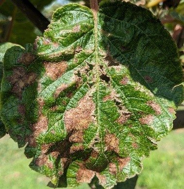
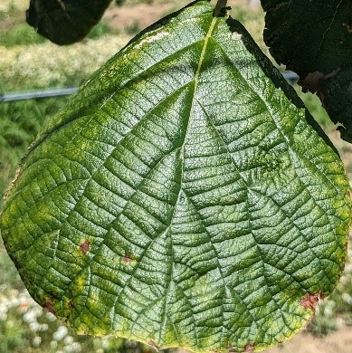
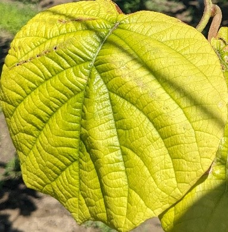
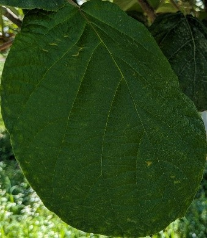

**AgriVision-Kiwi Dataset**

The proposed image dataset was gathered from kiwifruit fields in Chrysoupoli, in Kavala, Greece, which is one of the three most productive regions for kiwifruits in the country. The images were taken using a smartphone camera with a resolution of 1920×1024 pixels.

The images were captured during various hours of the day in summer from multiple kiwifruit plants, healthy and infected with one of the three diseases under study: Nematodes, Alternaria and Phytophthora, and contain one leaf per image:

| AgriVision-Kiwi Dataset| 
|----------------|
| 108 (Phytophthora)|
| 51 (Healthy)        | 
| 70 (Nematodes)      | 
| 33 (Alternaria)     | 

In Figure 1, indicative sample images from the AgriVision-Kiwi Dataset for each class are presented to provide a visual representation of the final dataset used for disease recognition.

<table align="center">
  <tr>
    <td align="center"> <strong>(a)</strong></td>
    <td align="center"> <strong>(b)</strong></td>
  </tr>
  <tr>
    <td align="center"> <strong>(c)</strong></td>
    <td align="center"> <strong>(d)</strong></td>
  </tr>
</table>
Figure 1. Image samples for disease recognition from the AgriVision-Kiwi Dataset for each class: (a) Alternaria disease; (b) Nematodes disease; (c) Phytophthora disease; (d) Healthy leaf

---

## 📜 Cite us

T. Kalampokas, E. Vrochidou, E. Mavridou, L. Iliadis, D. Voglitsis, M. Michalopoulou, G. Broufas and G. A. Papakostas. Empowering Kiwifruit Cultivation with AI: Leaf Disease Recognition Using AgriVision-Kiwi Open Dataset. *Electronics*. 2025; 14(9):1705. https://doi.org/10.3390/electronics14091705

---

